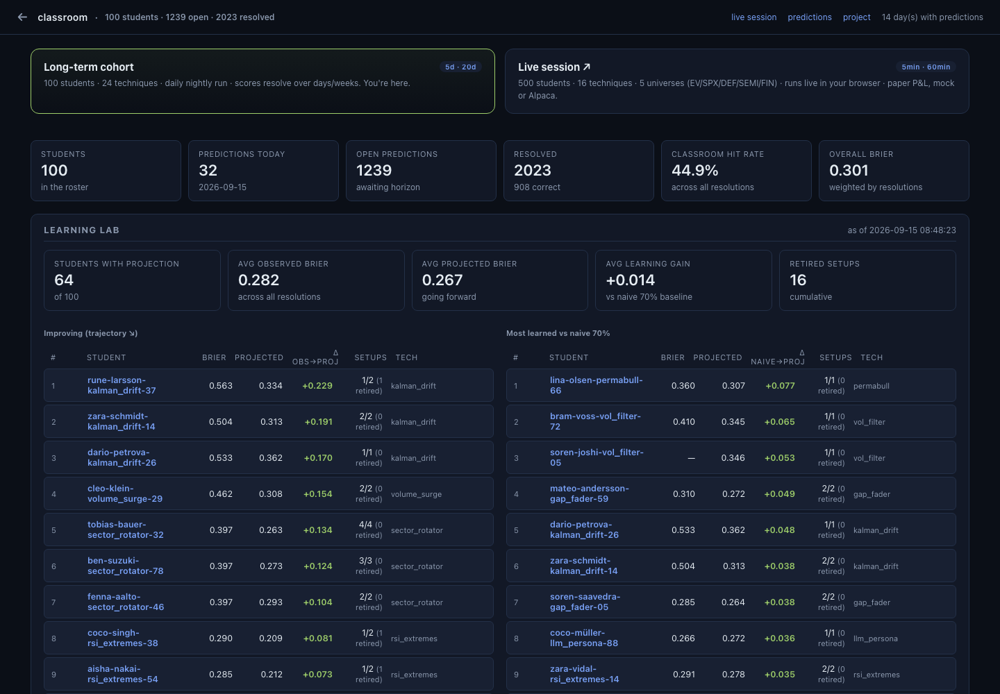
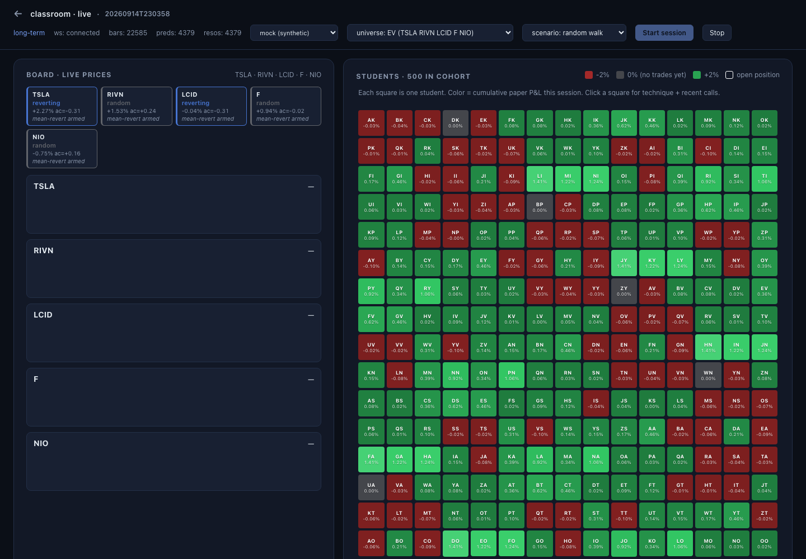

# Christian Verghis

Computer Science co-op student at McMaster University (class of 2027). Most recently a Software Engineer co-op at enedym (Jan–Aug 2026), building PCB test tooling, product tracking and CI/CD for switched reluctance motor production. Connected and Automated Vehicle sub-team lead on McMaster EcoCAR.

I like systems where software meets hardware: vehicles, motors, telemetry, simulation. The repos below are the side projects I keep coming back to. Everything here is MIT licensed unless the repo says otherwise.

## Embedded and vehicle

| Project | What it is |
|---|---|
| [ecu-telemetry](https://github.com/ChristianVerghis/ecu-telemetry) | A miniature connected-vehicle stack end to end: simulated ECU in C++, binary UDP/TCP protocol, FastAPI ingestion, SQLite time series, live dashboard, alerts and anomaly detection, OTA firmware versioning, and a scenario-driven software-in-the-loop environment. |
| [charger-tracker](https://github.com/ChristianVerghis/charger-tracker) | Reliability tracker for public EV chargers in Hamilton and the GTA. Next.js, Supabase and MapLibre over an Open Charge Map reference set. |
| [ebike-motor](https://github.com/ChristianVerghis/ebike-motor) | Design of a DIY coreless dual-rotor axial flux rear hub motor for a commuter e-bike: 240 mm, 12 coils / 14 poles, 350 W continuous, 750 W peak, VESC FOC with regen. Python sizing model, DXF, and the full decision log. Design stage, nothing built yet. |

## Games and graphics

| Project | What it is |
|---|---|
| [ATLA](https://github.com/ChristianVerghis/ATLA) | An Avatar-inspired bending game in Unreal Engine 5.8. Four elements, habitat levels, an AI duel opponent, C++ gameplay module plus Blueprints, and a Python remote-control layer that drives the editor for automated capture. Gameplay reel on my portfolio. |

## Tools and agents

| Project | What it is |
|---|---|
| [reef](https://github.com/ChristianVerghis/reef) | Local-first cockpit for running coding agents across many git repos at once. Long-lived daemon, agents as local subprocesses, learnings stratified and fed back. pnpm monorepo, Next.js, SQLite. |
| [dashboard](https://github.com/ChristianVerghis/dashboard) | The cockpit I run all of this from. Auto-discovers projects under one directory via a small `project.yml` manifest, shows commit activity, service health, goals and logs, and runs a nightly steward. FastAPI, no build step. |
| [claude-statusline](https://github.com/ChristianVerghis/claude-statusline) | Three-line status line for Claude Code: context left, 5-hour and weekly quota bars, reset times, git branch. |

## Research and writing

| Project | What it is |
|---|---|
| [model-f1](https://github.com/ChristianVerghis/model-f1) | How Formula 1 cars evolved across regulation eras. A hand-curated dataset of 50 era-defining cars from the 1955 W196 to the 2024 MCL38, with aero eras, regulation inflection points and hybrid power units, explored through gallery, compare, scatter and timeline views. Next.js, TypeScript, Tailwind, Recharts. |
| [folded-flight](https://github.com/ChristianVerghis/folded-flight) | From paper airplanes to 3D-printed drones. Volume I covers nine paper airplanes with fold sequences and crease patterns. Volume II derives nine printable drone concepts from the same principles and rates each on Reynolds-number transfer. Generated from two JSON files by stdlib Python. |
| classroom (private) | A synthetic research lab: 100 forecaster personas, each running a named technique, make daily calibrated predictions over an EV watchlist and get Brier-scored as they resolve. A second 500-student cohort paper-trades intraday in the browser. The point is to find which forecasting techniques stay well calibrated, not to trade. |

   
  classroom: the long-term cohort board. 100 students, 2,000+ resolved predictions, per-technique learning gain.

   
  classroom live: 500 students paper-trading a synthetic EV universe, one square each, coloured by session P&amp;L.

## Elsewhere

- Portfolio and gameplay reel: <!-- TODO: portfolio URL -->
- [caspian-sdk](https://github.com/ChristianVerghis/caspian-sdk): fork with a fix for skipping malformed channel events.
