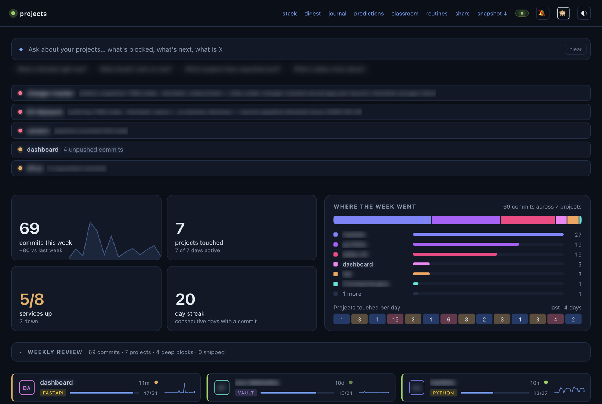

# Christian Verghis

Embedded software for electric vehicles. Computer Science co-op student at McMaster University, graduating April 2028.

- **enedym** (Software Engineer co-op, January to December 2026): a production test kiosk and its fixture with bootloader flashing, live CAN telemetry from fielded motor drives, and product tracking for switched reluctance motor production.
- **McMaster EcoCAR**: Connected and Automated Vehicle team; autonomous intersection navigation on a 2023 Cadillac Lyriq in C, C++ and Python, validated on a hardware-in-the-loop rig. The team placed 2nd in North America in 2026.
- **Portfolio**: [christianverghis.vercel.app](https://christianverghis.vercel.app), with photos from the bench, a fixture bring-up write-up and the Fourfold trailer.

I like systems where software meets hardware: vehicles, motors, telemetry, simulation. The repos below are the side projects I keep coming back to. Everything here is MIT licensed unless the repo says otherwise.

## Embedded and vehicle

| Project | What it is |
|---|---|
| [ecu-telemetry](https://github.com/ChristianVerghis/ecu-telemetry) | A miniature connected-vehicle stack end to end: simulated ECU in C++, binary UDP/TCP protocol, FastAPI ingestion, SQLite time series, live dashboard, alerts and anomaly detection, OTA firmware versioning, and a scenario-driven software-in-the-loop environment. |
| [charger-tracker](https://github.com/ChristianVerghis/charger-tracker) | Reliability tracker for public EV chargers in Hamilton and the GTA. Next.js, Supabase and MapLibre over an Open Charge Map reference set. |
| [ebike-motor](https://github.com/ChristianVerghis/ebike-motor) | Design of a DIY coreless dual-rotor axial flux rear hub motor for a commuter e-bike: 240 mm, 12 coils / 14 poles, 350 W continuous, 750 W peak, VESC FOC with regen. Python sizing model, DXF, and the full decision log. Design stage, nothing built yet. |

## Games and graphics

| Project | What it is |
|---|---|
| [Fourfold](https://github.com/ChristianVerghis/Fourfold) | A four-element bending combat game in Unreal Engine 5.8: Gameplay Ability System element kits in C++, themed habitats, an AI duel opponent, 16 chained combos, and a Python remote-control layer that drives the editor for automated capture. Trailer on my portfolio. |

## Tools and agents

| Project | What it is |
|---|---|
| [reef](https://github.com/ChristianVerghis/reef) | Local-first cockpit for running coding agents across many git repos at once. Long-lived daemon, agents as local subprocesses, learnings stratified and fed back. pnpm monorepo, Next.js, SQLite. |
| [dashboard](https://github.com/ChristianVerghis/dashboard) | The cockpit I run all of this from. Auto-discovers projects under one directory via a small `project.yml` manifest, shows commit activity, service health, goals and logs, and runs a nightly steward. FastAPI, no build step. |
| [claude-statusline](https://github.com/ChristianVerghis/claude-statusline) | Three-line status line for Claude Code: context left, 5-hour and weekly quota bars, reset times, git branch. |

   
  dashboard, private mode on: ask it what is blocked, an attention strip of stale and unpushed work, the week in numbers, one tile per repo. Names blur, everything stays live.

## Research and writing

| Project | What it is |
|---|---|
| [model-f1](https://github.com/ChristianVerghis/model-f1) | How Formula 1 cars evolved across regulation eras. A hand-curated dataset of 50 era-defining cars from the 1955 W196 to the 2024 MCL38, with aero eras, regulation inflection points and hybrid power units, explored through gallery, compare, scatter and timeline views. Next.js, TypeScript, Tailwind, Recharts. |
| [folded-flight](https://github.com/ChristianVerghis/folded-flight) | From paper airplanes to 3D-printed drones. Volume I covers nine paper airplanes with fold sequences and crease patterns. Volume II derives nine printable drone concepts from the same principles and rates each on Reynolds-number transfer. Generated from two JSON files by stdlib Python. |
| classroom (private) | A synthetic research lab: 100 forecaster personas, each running a named technique, make daily calibrated predictions over an EV watchlist and get Brier-scored as they resolve. A second 500-student cohort paper-trades intraday in the browser. The point is to find which forecasting techniques stay well calibrated, not to trade. |

   
  classroom live, mid-session: live prices for the EV universe on the left, 500 students on the right, one square each, coloured by paper P&amp;L.

## Elsewhere

- Portfolio, résumé and the Fourfold trailer: [christianverghis.vercel.app](https://christianverghis.vercel.app)
- [caspian-sdk](https://github.com/ChristianVerghis/caspian-sdk): fork with a fix for skipping malformed channel events.
