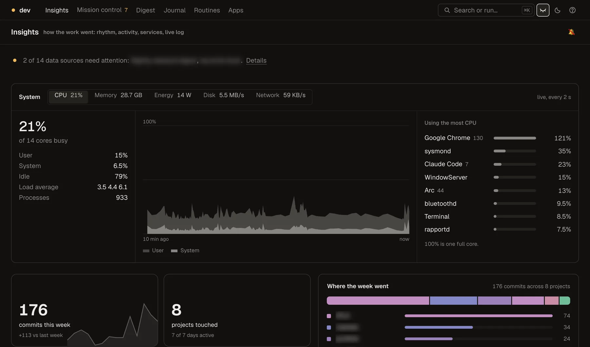

# Christian Verghis

Embedded software for electric vehicles. CS co-op at McMaster, graduating April 2028.
Portfolio, résumé and the Fourfold trailer: **[christianverghis.vercel.app](https://christianverghis.vercel.app)**

- **enedym**, Software Engineer co-op (2026): production test kiosk and fixture, bootloader flashing, live CAN telemetry for switched reluctance motor drives
- **McMaster EcoCAR**, CAV team: autonomous intersection navigation on a Cadillac Lyriq, validated on a HIL rig. 2nd in North America, 2026

## Embedded and vehicle

- **[ecu-telemetry](https://github.com/ChristianVerghis/ecu-telemetry)**: connected-vehicle stack end to end, from a C++ ECU sim to a live dashboard, with OTA and SIL scenarios
- **[charger-tracker](https://github.com/ChristianVerghis/charger-tracker)**: reliability tracker for public EV chargers in Hamilton and the GTA
- **[ebike-motor](https://github.com/ChristianVerghis/ebike-motor)**: DIY coreless axial flux hub motor, with sizing model, DXF and decision log (design stage)

## Tools and agents

- **[dashboard](https://github.com/ChristianVerghis/dashboard)**: mission control for 22 repos and the agents working in them, with insights, a live system monitor and ⌘K for everything
- **[reef](https://github.com/ChristianVerghis/reef)**: local-first cockpit for running coding agents across many repos at once
- **[claude-statusline](https://github.com/ChristianVerghis/claude-statusline)**: Claude Code status line with context left, quota bars and git branch

   
  dashboard Insights in private mode: live system panel up top, the week in commits below. Personal project names blur.

## Games, research and writing

- **[Fourfold](https://github.com/ChristianVerghis/Fourfold)**: four-element bending combat game in Unreal Engine 5.8, with C++ ability kits, an AI duel and 16 combos
- **[model-f1](https://github.com/ChristianVerghis/model-f1)**: how F1 cars evolved across regulation eras, 50 cars from 1955 to 2024
- **[folded-flight](https://github.com/ChristianVerghis/folded-flight)**: from paper airplanes to 3D-printed drones, in two volumes
- **classroom** *(private)*: 100 forecaster personas, Brier-scored daily, to find which forecasting techniques stay calibrated

Also: [caspian-sdk](https://github.com/ChristianVerghis/caspian-sdk), a fork with a fix for malformed channel events.
